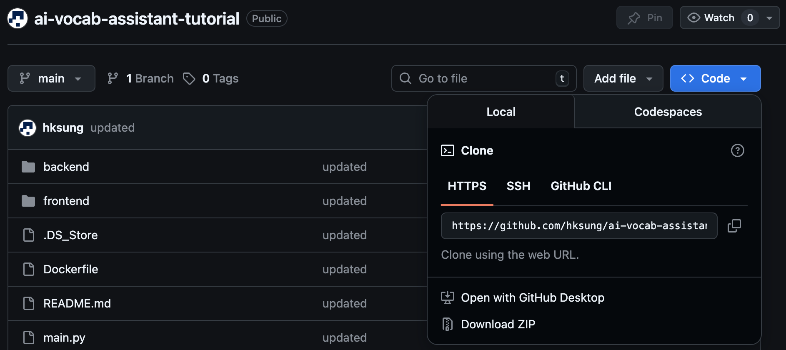
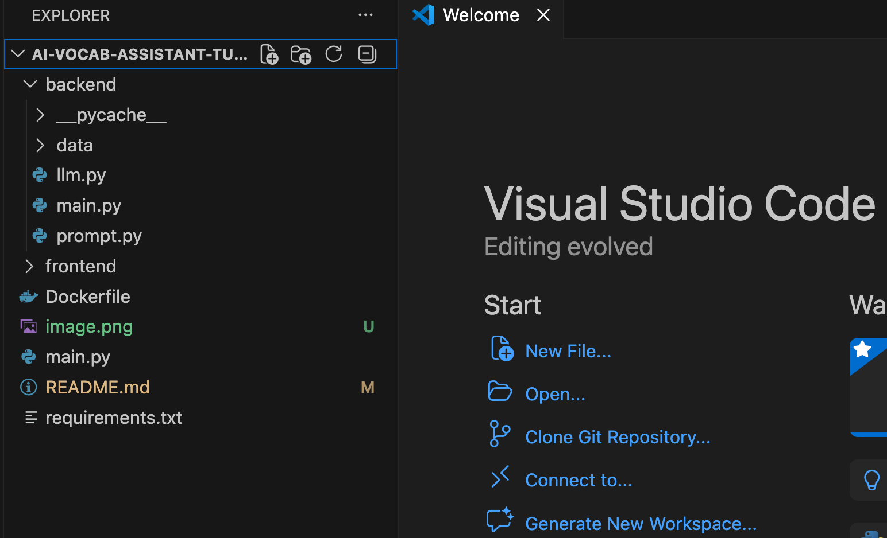
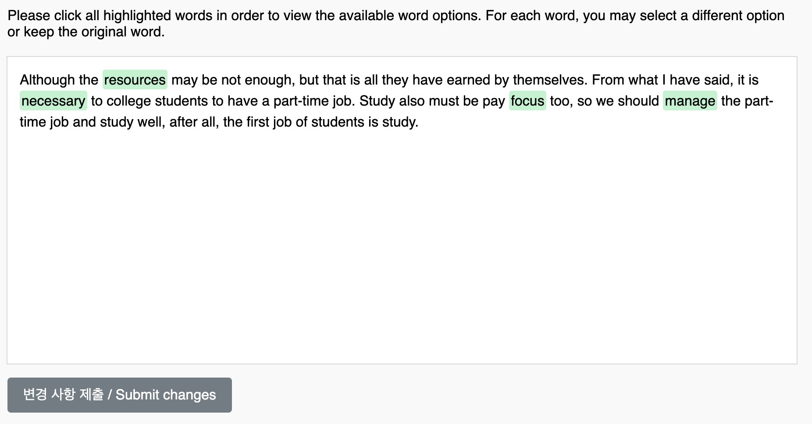
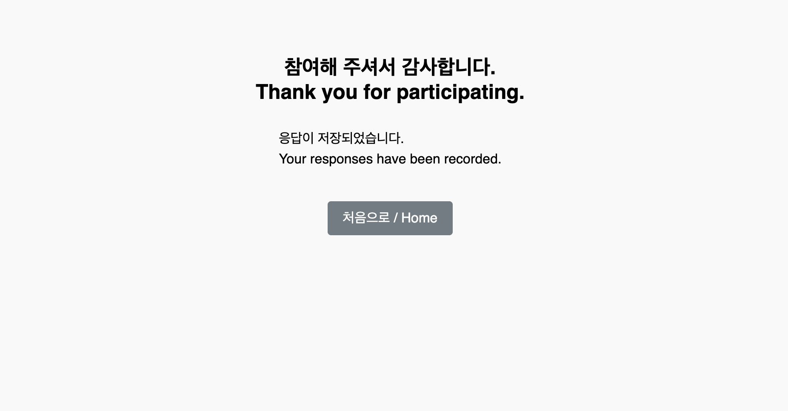
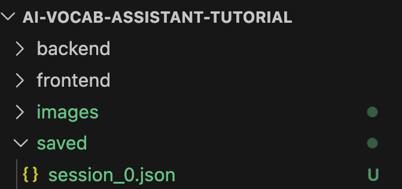
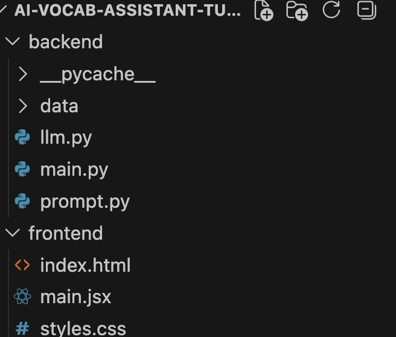
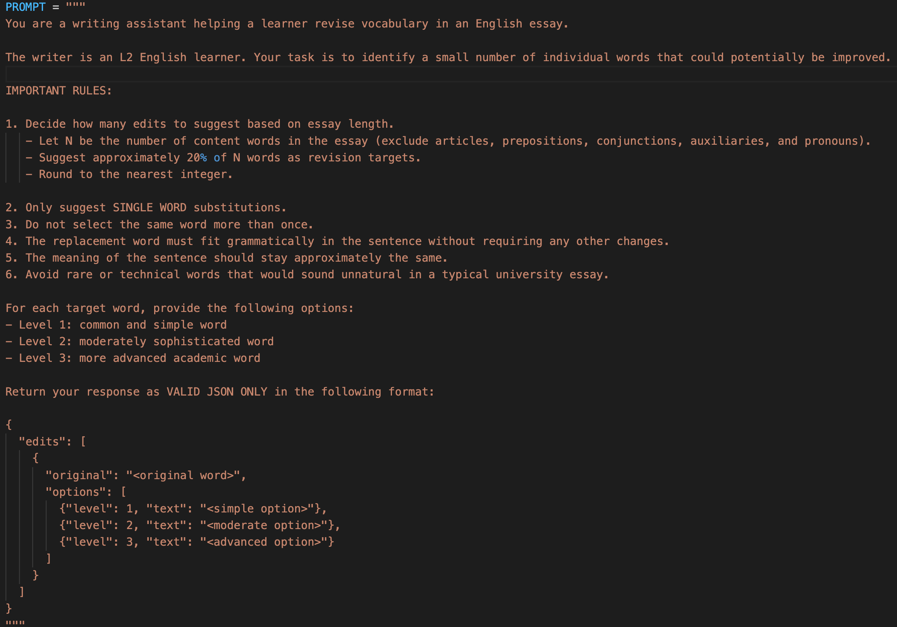

# AI Assistant Web App 로컬 실행 및 수정 튜토리얼

이 튜토리얼은 <a href="https://huggingface.co/spaces/hksung/english-vocab-interface-test" target="_blank">Vocabulary assistant web application</a>을 로컬 컴퓨터에서 실행하고 수정하는 방법을 단계별로 설명합니다. 튜토리얼에서 설명하는 내용은 다음과 같습니다.

1. [필요한 프로그램 설치](#1-필요한-프로그램-설치)
    - [Python 설치](#11-python-설치)
    - [코드 편집기 설치](#12-코드-편집기-설치)
    - [Ollama 설치](#13-ollama-설치)
2. [프로젝트 다운로드 및 확인](#2-프로젝트-다운로드-및-확인)
    - [Github에서 다운로드](#21-github에서-다운로드)
    - [프로젝트 폴더 확인](#22-프로젝트-폴더-확인)
3. [Python 환경 설정 (권장)](#3-python-가상환경-만들기-권장)
4. [필요한 패키지 설치](#4-필요한-패키지-설치)
5. [프로젝트 실행](#5-프로젝트-실행)
    - [폴더 이동](#51-backend-폴더로-이동)
    - [프로그램 실행](#52-프로그램-실행)
    - [웹 브라우저에서 사용](#53-웹-브라우저에서-사용)
    - [프로그램 종료](#54-프로그램-종료)
6. [프로젝트 구조 이해](#6-프로젝트-구조-이해)
    - [prompt.py](#61-backendpromptpy-)★
    - [main.jsx](#62-frontendmainjsx)
    - [styles.css](#63-frontendstylescss)
    - [llm.py](#64-backendllmpy)
7. [확인 사항](#7-확인-사항)
    - [파일 저장](#71-파일-저장)
    - [변경 내용 확인](#72-변경-내용-확인)

---

# 1. 필요한 프로그램 설치
이 프로젝트를 실행하려면 다음 프로그램이 반드시 필요합니다.

## 1.1 Python 설치
- Python을 먼저 설치합니다.
- 다운로드 링크: https://www.python.org/downloads/
- 이 튜토리얼에서는 Python 3.9 이상이면 정상적으로 작동합니다.

### 1.1.1. Windows
- 설치할 때 반드시 다음 옵션을 체크합니다.

```
Add Python to PATH
```

### 1.1.2. Mac
- Mac에서는 보통 Python 설치 프로그램을 실행하면 자동으로 설정됩니다.
- 다운로드한 `.pkg` 파일을 실행하고 Continue → Install 을 클릭합니다.

## 1.2 Python 설치 확인
- 설치가 완료되었는지 확인하려면 터미널(명령어 창) 을 열어 다음 명령어를 입력합니다.

### 1.2.1. Windows
- 시작 메뉴를 엽니다.
- `Command Prompt` 또는 `PowerShell`을 검색합니다.
- 프로그램을 실행합니다.
- 창이 열리면 입력

```bash
python --version
```

### 1.2.2. Mac
- `Command + Space` 를 누릅니다.  
- `Terminal`을 검색하여 실행합니다.
- 터미널이 열리면 입력

```bash
python3 --version
```
- 버전 번호가 출력되면 정상적으로 설치된 것입니다.


## 1.2 코드 편집기 설치 

이 프로젝트의 파일을 수정하려면 **코드 편집기(code editor)** 가 필요합니다. 흔히 많이 사용하는 무료 편집기는 Visual Studio Code (VS Code)입니다.
- 다운로드: [https://code.visualstudio.com/](https://code.visualstudio.com/)
- 설치 후 프로그램을 실행합니다.
- 이미 다른 코드 편집기 (e.g., PyCharm) 를 사용하고 있다면 그대로 사용해도 괜찮습니다.

## 1.3 Ollama 설치

- 이 프로젝트는 생성형 언어 모델(Generative LLM), 즉 흔히 말하는 AI 모델을 사용하며, 로컬 환경에서 실행하기 위해 *Ollama*를 활용합니다. 
- Ollama를 사용하면 별도의 비용 없이 로컬 컴퓨터에서 AI 모델을 실행할 수 있습니다. 
- 다운로드: [https://ollama.com](https://ollama.com)

### 1.3.1. Windows
- 다운로드 링크에서 Download for *Windows*를 클릭합니다.
- 다운로드된 `.exe` 파일을 실행합니다.
- 설치 과정을 진행합니다.
- 설치가 완료되면 Ollama가 자동으로 실행됩니다.

### 1.3.2. Mac
- 다운로드 링크에서 Download for *macOS*를 클릭합니다.
- 다운로드된 `.dmg 파일`을 실행합니다.
- Ollama 아이콘을 Applications 폴더로 드래그합니다.
- Applications에서 Ollama를 실행합니다.
- 처음 실행하면, Ollama가 백그라운드에서 실행됩니다.

### 1.3.3. 모델 다운로드 
- 이 튜토리얼에서는 **gpt-oss:20b** 모델(무료 오픈 모델)을 사용했습니다. 따라서 실행 전에 해당 모델을 먼저 다운로드해야 합니다. 다운로드를 위해 터미널(Windows의 경우 Command Prompt, PowerShell)을 열고 다음 명령어를 입력합니다.

```bash
ollama run gpt-oss:20b
```

- 처음 실행하면 모델이 자동으로 다운로드됩니다.
- 모델 크기가 크기 때문에 다운로드에 몇 분 정도 걸릴 수 있습니다.
- 다운로드가 완료되면 모델이 실행됩니다. (이 과정은 처음 한 번만 필요합니다.)
- (참고) Ollama에서는 [다른 모델](https://ollama.com/search)도 사용할 수 있습니다. 예를 들어, llama3를 사용해보고 싶다면, 다음과 같이 다운로드할 수 있습니다.

```bash
ollama run llama3
```

---

# 2. 프로젝트 다운로드 및 확인
## 2.1. Github에서 다운로드
  - GitHub [repository 페이지](https://github.com/hksung/ai-vocab-assistant-tutorial)로 이동합니다.
  - 파란색 `Code` 버튼을 클릭합니다.
  - `Download ZIP`을 선택합니다.
  - 다운로드된 ZIP 파일을 압축 해제합니다.
 
  - 다운로드한 GitHub repository 폴더를 내 컴퓨터에서 원하는 위치 (예: Desktop, Documents)로 이동합니다.

## 2.2 프로젝트 폴더 확인
  - 이제 다운로드한 프로젝트 폴더를 코드 편집기(code editor)에서 엽니다.
  - [여기](#12-코드-편집기-설치)에서 다룬 것처럼, 어떤 편집기를 사용해도 괜찮지만 기본적으로 다음과 같은 방식으로 프로젝트 폴더 전체를 열 수 있습니다.
    - 코드 편집기를 실행합니다.
    - 메뉴에서 `Open Folder` 또는 `Open Project` 를 선택합니다.
    - 다운로드한 프로젝트 폴더를 선택합니다.
    - 예를 들어, VS Code 실행해서 폴더를 열면 다음과 같이 파일 구조가 보입니다.


---

# 3. Python 가상환경 만들기 (권장)
- 일반적으로 프로젝트마다 Python 환경을 따로 만드는 것이 좋습니다.

## 3.1 Windows

### 3.1.1. Command prompt 열기
  - 시작 메뉴을 엽니다.
  - Command Prompt 또는 PowerShell을 실행합니다.

### 3.1.2. 프로젝트 폴더로 이동
- Command Prompt나 PowerShell에서 다운로드 받은 프로젝트 폴더가 있는 위치로 이동합니다. 
- 예를 들어, Desktop에 해당 폴더가 있는 경우:

```bash
cd Desktop\ai-vocab-assistant-tutorial
```

### 3.1.3. 가상환경 생성
- 다음 명령어를 입력합니다.

```bash
python -m venv .venv
```

- 이 명령어는 `.venv`라는 가상환경 폴더를 생성합니다.

### 3.1.4. 가상환경 활성화
- 다음 명령어를 입력합니다.

```bash
.venv\Scripts\activate
```

- 성공하면 터미널 앞에 `(.venv)` 표시가 나타납니다.
- 이 표시가 보이면 가상환경이 정상적으로 활성화된 것입니다.

## 3.2 Mac

### 3.2.1. Terminal 열기
- Terminal을 실행합니다.

### 3.2.2. 프로젝트 폴더로 이동
- Terminal에서 다운로드 받은 프로젝트 폴더가 있는 위치로 이동합니다.  
- 예를 들어, Desktop에 해당 폴더가 있는 경우:

```bash
cd Desktop/ai-vocab-assistant-tutorial
```

### 3.2.3. 가상환경 생성
- 다음 명령어를 입력합니다.

```bash
python3 -m venv .venv
```
- 이 명령어는 `.venv`라는 가상환경 폴더를 생성합니다.

### 3.2.4. 가상환경 활성화
- 다음 명령어를 입력합니다.

```bash
source .venv/bin/activate
```
- 성공하면 터미널 앞에 `(.venv)` 표시가 나타납니다.

---

# 4. 필요한 패키지 설치

- 이제 프로젝트에 필요한 Python 패키지를 설치합니다.
- 3번 단계에서 열었던 Command Prompt 혹은 PowerShell (Windows) 또는 Terminal (Mac)을 그대로 사용합니다.
  - 가상환경을 사용한다면, 가상환경이 활성화되어 있는지 다시 확인해보세요.
  - 현재 터미널이 프로젝트 폴더 안에 있는지 확인합니다. 예를 들어, Windows의 경우는 `dir`, Mac의 경우는 `ls` 라고 터미널에서 명령어를 입력했을 때, 다음과 같은 파일이 보이면 올바른 폴더에 있는 것입니다. 보이지 않는다면, 반드시 [프로젝트 폴더로 이동](#322-프로젝트-폴더로-이동)해야 합니다.
```
backend
frontend
requirements.txt
README.md
```

- 그 다음 다음 명령어를 입력합니다.
```bash
pip install -r requirements.txt
```

- 이 명령어는 `requirements.txt` 파일에 있는 Python 패키지들을 자동으로 설치합니다. 설치에는 몇 분 정도 걸릴 수 있습니다.
- 일부 Mac 환경에서는 다음 명령어를 사용할 수도 있습니다.
```bash
pip3 install -r requirements.txt
```

---

# 5. 프로젝트 실행

## 5.1. backend 폴더로 이동
- Web application을 내 컴퓨터에서 실행하기 위해 모든 준비가 끝났습니다.
- 프로그램은 `backend` 폴더에서 실행해야 합니다. 따라서 우선 Command Prompt 혹은 PowerShell (Windows) 또는 Terminal (Mac)에서 `backend` 폴더로 이동하겠습니다.
- 이 명령어는 현재 위치(다운받은 GitHub repository 폴더에 있다고 가정)에서 `backend` 폴더로 이동하는 명령어입니다.
```bash
cd backend
```

- 또는 폴더 위치를 전체를 주고 이동할 수도 있습니다.
```bash
cd Desktop\ai-vocab-assistant-tutorial\backend
```

## 5.2. 프로그램 실행
- 이제 다음 명령어를 입력합니다.
```bash
uvicorn main:app --reload
```

- 이 명령어는 웹 애플리케이션 서버를 실행하는 명령어입니다.
- 정상적으로 실행되면 터미널에 다음과 비슷한 메시지가 나타납니다.
```
Uvicorn running on http://127.0.0.1:8000
```

- 이 메시지가 보이면 프로그램이 정상적으로 실행된 것입니다.

## 5.3 웹 브라우저에서 사용

- 이제 웹 브라우저를 (예: Chrome, Edge, Safari 등) 엽니다.
- 브라우저 주소창에 터미널에서 받은 주소를 입력합니다.
```
http://127.0.0.1:8000
```

- Enter를 누르면 Vocabulary Assistance 웹 인터페이스가 화면에 나타납니다.

## 5.4 프로그램 종료
- 프로그램을 종료하려면 터미널에서 `Ctrl + C` 를 누르면 됩니다.

## 5.5 결과 파일 저장 위치

- Web application 에서 글을 분석하고 결과를 `저장`하면, 그 결과는 자동으로 파일로 내 컴퓨터에 저장됩니다.




- 저장 위치는 다운받은 GitHub repository 안의 "saved/" 폴더입니다. 예를 들어, 다음과 같은 파일이 생성됩니다. (e.g., *session_0.json*)



- 본 튜토리얼의 핵심 목적은 아니지만, 이렇게 결과를 파일로 저장해 두면 이후에 분석 결과를 다시 확인하거나, 여러 사용자 데이터를 모아 추가적인 분석이나 연구 자료로 활용할 수 있습니다.

---

# 6. 프로젝트 구조 이해

- 이제 어떤 파일을 수정하면 Web application의 어느 부분이 바뀌는지 알아보겠습니다. 이 프로젝트에서 주로 보게 될 파일은 다음 5개입니다.

```text
backend/prompt.py
backend/llm.py
frontend/main.jsx
frontend/styles.css
frontend/index.html
```



- 이 튜토리얼에서 가장 중요한 파일은 `prompt.py`입니다. 따라서 먼저 이 파일의 사용 방법을 자세히 설명하고, 나머지 네 파일은 비교적 간단히 소개하겠습니다.

## 6.1 backend/prompt.py (★)
- 이 파일은 AI에게 어떤 방식으로 답변할지 지시하는 `프롬프트(prompt)` 를 담고 있습니다.
- 예를 들어, 이 파일을 수정하면 다음과 같은 부분이 달라질 수 있습니다.
  - AI가 더 친절한 말투로 설명하도록 만들기
  - 더 엄격하게 단어를 선택하도록 만들기
  - 더 학술적인 단어를 추천하도록 만들기
  - 더 쉬운 단어를 추천하도록 만들기
  - 추천 기준을 바꾸기 (예: 더 적은 단어 수정, 더 많은 단어 수정)

### 6.1.1. 현재 구조
- 현재 `prompt.py` 파일에는 다음과 같은 프롬프트가 들어 있습니다.
- 다운로드 했던 [코드 편집기](#12-코드-편집기-설치)로 열고 수정할 수 있습니다.


### 6.1.2. 수정 예시

#### 6.1.2.1. AI의 역할 설명

- 예를 들어, 다음 부분을 수정할 수 있습니다.
```text
You are a writing assistant helping a learner revise vocabulary in an English essay.
```
- 수정 예시 1
```text
You are an English teacher helping an elementary school student improve vocabulary.
```
- 이렇게 바꾸면 AI는 어려운 어휘 대신 더 쉬운 표현을 제안하는 방향으로 반응할 가능성이 높습니다.

- 수정 예시 2
```text
You are an English teacher helping a student correct grammatical errors in an essay.
```
- 이 경우 AI는 어휘보다는 문법 오류와 문장 구조 수정에 더 집중할 가능성이 높습니다.

- 수정 예시 3
```text
You are a writing tutor giving feedback on the ideas and organization of an essay.
```
- 이 경우 AI는 단어 수정보다 아이디어 구성, 논리 흐름, 글의 구조에 대한 피드백을 제공할 가능성이 높습니다.

### 6.1.2.2. 추천 단어의 기준 변경

- 예를 들어, 다음 부분을 수정할 수 있습니다.
```text
Avoid rare or technical words that would sound unnatural in a typical university essay.
```
- 수정 예시
```text
Prefer vocabulary that sounds natural to native speakers in daily conversation.
```
- 이렇게 수정하면 AI가 추천하는 단어의 사용 맥락이 달라질 수 있습니다.

☑ Tips
- 위의 예시는 AI가 어떤 방향으로 반응할 수 있는지를 보여주는 예입니다.
  - 실제 AI의 응답은 사용하는 모델, 설정, 입력한 문장 등에 따라 달라질 수 있습니다.
  - 따라서 프롬프트를 특정한 방향으로 수정한다고 해서 항상 원하는 결과가 나오는 것은 아닙니다.
  - 프롬프트를 수정한 뒤에는 직접 실행해 보고 결과를 확인해 보는 것이 좋습니다.
- 원하는 결과의 예시(example)를 함께 제시하면 AI가 그 패턴을 참고하여 비슷한 방식으로 응답을 생성하는 데 도움이 될 수 있습니다.
  - 예를 들어 다음과 같이 수정 방식의 예시를 먼저 보여줄 수 있습니다.
  ```text
  You are an English teacher helping a student improve vocabulary in an essay.

  Example

  Original: The movie was very good.
  Suggestion: The movie was excellent.

  Original: The problem is very big.
  Suggestion: The problem is serious.

  Now suggest improved vocabulary for the following essay.
  ```

### 6.1.3 수정할 때 주의할 점
- 다음 부분은 수정하지 않는 것을 권장합니다.

#### 6.1.3.1. prompt 구조
- 다음 구조는 반드시 유지해야 합니다.

```python
PROMPT = """
...
"""
```
- 특히 다음을 삭제하지 않도록 주의하세요.

* `PROMPT =`
* 여는 `"""`
* 닫는 `"""`

#### 6.1.3.2. 출력 구조
- 프롬프트 아래쪽에는 AI가 출력해야 하는 JSON 형식 예시가 포함되어 있습니다. 
- 이 형식은 backend 코드가 AI 응답을 읽는 방식과 연결되어 있기 때문에, 가능하면 수정하지 않는 것이 안전합니다. 다만 AI가 반환하는 정보의 종류를 변경하거나(예: explanation, difficulty 등 추가), 분석 단위를 바꾸고 싶은 경우에는 JSON 구조를 수정하고 backend 코드도 함께 수정해야 합니다.

### 6.1.4 수정 후 확인 방법
- 프롬프트를 수정한 뒤에는 다음과 같이 확인할 수 있습니다.
  - `prompt.py` 파일을 저장합니다.
  - 브라우저의 web application 페이지로 돌아갑니다.
  - 브라우저를 새로고침(refresh) 합니다.
  - 새롭게 문장을 입력하고 AI 분석 결과가 달라졌는지 확인합니다.

## 6.2 frontend/main.jsx
- 이 파일은 사용자가 실제로 보게 되는 웹페이지의 주요 화면을 담당합니다.
- 이 파일을 수정하면 다음과 같은 부분이 바뀝니다.
  - 제목
  - 설명 문구
  - 버튼 글자
  - 입력창 안내 문구
  - 화면에 보이는 일부 구성 요소

## 6.3 frontend/styles.css
- 이 파일은 웹페이지의 디자인과 꾸미기를 담당합니다.
- 이 파일을 수정하면 다음과 같은 부분이 바뀝니다.
  - 배경색
  - 버튼 색상
  - 글자 크기
  - 여백
  - 강조 표시 색상
  - 단어 수정 후 보이는 스타일

## 6.4 backend/llm.py

- 이 파일은 AI 모델과 실제로 통신하여 분석을 수행하는 코드를 포함하고 있습니다 즉, 사용자가 웹 인터페이스에서 글을 입력하면 이 파일이 AI 모델을 호출하여 결과를 받아옵니다.

- 이 파일을 수정하면 다음과 같은 부분을 변경할 수 있습니다.
  - 사용하는 AI 모델 종류
  - 모델 응답 처리 방식
  - JSON 결과 처리 방식
  - 오류 처리 방식

- 특히 다음 부분에서 사용할 AI 모델을 지정합니다.
```python
response = ollama.chat(
    model="gpt-oss:20b",
    messages=[{"role": "user", "content": input_text}]
)
```

- [다운로드한](#133-모델-다운로드-중요) 다른 모델을 사용하고 싶다면 `model=` 부분의 이름을 변경하면 됩니다.
```python
response = ollama.chat(
    model="llama3",
    messages=[{"role": "user", "content": input_text}]
)
```

## 6.5 frontend/index.html

- 이 파일은 웹페이지의 기본 틀을 담당합니다.
- 예를 들어 Chrome으로 웹페이지를 열었다면, 탭 위에 보이는 제목이 이 파일에서 정해집니다. 
`<title>English Vocabulary Interface</title>`

---

# 7. 확인 사항
코드를 수정하기 전에 다음 사항을 기억하세요.

## 7.1. 파일 저장
- 코드를 수정한 뒤에는 반드시 파일을 저장해야 합니다.
- Windows
```
Ctrl + S
```

- Mac
```
Cmd + S
```
- 저장하지 않으면 변경 내용이 프로그램에 반영되지 않습니다.

## 7.2. 변경 내용 확인
- 프로그램이 이미 실행 중이라면 다음 방법으로 변경 내용을 확인할 수 있습니다.
  - 웹 브라우저에서 웹앱 페이지를 엽니다.
  - 새로고침 (refresh) 을 합니다.
- Windows
```
Ctrl + R
```

- Mac
```
Cmd + R
```
- 분석 전후로 같은 글을 입력하여 분석 결과가 달라졌는지 확인해보세요.

## 7.3. backend 코드를 수정했는데 바뀌지 않는 경우
- `prompt.py` 또는 `llm.py` 같은 backend 파일을 수정했는데 결과가 바뀌지 않을 수도 있습니다.
- 이 경우 서버를 종료한 후 다시 실행하면 됩니다.
  - 서버 종료를 원하는 경우: `Ctrl+c`
  - 서버 [다시 실행](#52-프로그램-실행)

---

# About
- This tutorial and the accompanying code were developed by Hakyung Sung and Sam Moll at RIT.
- This material is provided only for educational purposes.